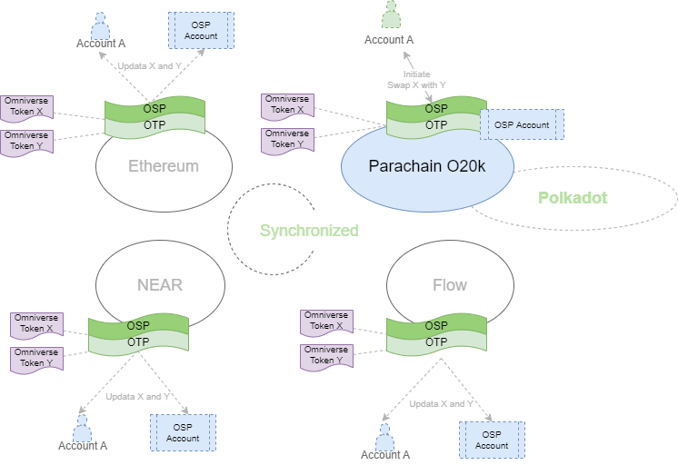
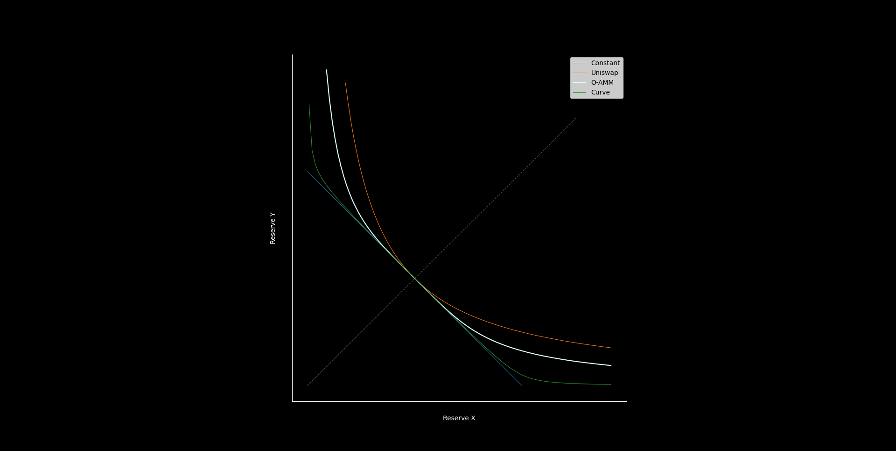

## 基本资料

项目名称：O20k (Omniverse Protocol Stack)

项目立项日期 (哪年哪月)：2022.12

## 项目整体简介

### Background
In current technology state of the art, there are two ways to exchange tokens deployed on different public chains, the one is through CEX, the other is transferring through bridges first and then swapping.  
In Web3 world, CEX is just a temporary solution because there's no need for Web3 if centralized. We know that CEX has a high speed for exchanges, but a more important thing is that it provides a free way for most kinds of tokens no matter which blockchain they are deployed on. But now, we will provide an absulotely decentralized way.    
With bridges, the assets should be locked on one chain and minted on another chain so that your assets are cut into different parts on different chains and one part can be only used on one chain at a time. Moreover, many [secure events](https://github.com/xiyu1984/Blog/blob/main/docs/Multi-Chain%20Events.md) happened on current bridges.  

We will provide an absolutely decentralized and cryptographic-based solution to solve these problems, through which the exchange between tokens deployed on different chains can be processed with determining security. Besides, there's no need to divide your assets into different isolated parts, on the contrary, your assets can be accessed from any chain and be treated as a whole.

### Introduction
We are building an absolutely decentralized swap platform called `Omniverse Protocol Stack` (`O20k` for short) to make exchanges for different kinds of tokens distributed all over the Web3 world.  
First, we provide a brand new token protocol called `Omniverse Token Protocol`(`OTP` for short), whose legality can be synchronized to any chain where `OTP` is deployed so that it to be accessed and operated anywhere at the same time as a whole, which is unlike being divided into isolated parts by token bridges. Besides, `OTP` is able to be compatible with current single-chain token protocols.  
Second, an `Omniverse Swap Protocol` (`OSP` for short) is provided to make exchanges for different kinds of OTP tokens just like a CEX did but in a decentralized way. One `OTP` token can directly exchange with another `OTP` token on Polkadot, and the related states could be verifiable on other `O20k` deployed ecosystems such as Ethereum, NEAR, Flow, Move chains, etc.
Moreover, AMM is used to make calculations for exchanges and we innovatively worked out a new mathematical model called `O-AMM` to implement it, which can provide a wider "smooth trading range" than state of art and still keep the price sensitivity. 

We will build a Substrate Parachain to make out `O20k`, which can connect the other Parachains by `XCM` so that `O20k` could provide services for the whole ecosystem of Polkadot.  

* The `OTP` has the following features:  
  * The token based on `OTP` deployed on different chains is not separated but as a whole. If someone has one `OT`P based token $X$ on Polkadot, he will have one on Ethereum and other chains at the same time.   
  * The state of the tokens based on `OTP` is synchronous on different chains. If someone sends/receives one token $X$ on Polkadot, he will send/receive one token $X$ on Ethereum and other chains at the same time.  
  * The `OTP` works as below:  

Figure.1 Workflow of OTP

* The `OSP` has the following features:  
  * `OSP` is a decentralized DEX platform for Omniveser Tokens. Omniverse token $X$ can be exchanged with Omniverse token $Y$ through `OSP`. Similiar to `OTP`, the swap happens as a whole on Polkadot and other blockchains. If someone initiate a swap of $X$ with $Y$, he will give out some amount of $X$ and get related amount of $Y$ on Polkadot and all blockchains where `O20k` deployed.  
  * The Omniverse account of `OSP` is managed by the consensus of the `O20k` Parachain.
  * The `OSP` works as below:  

Figure.2 Workflow of OSP

* The [O-AMM](./docs/Principle%20of%20Omniverse%20AMM.md) is the core mechanism supporting the underlying exchanges of the `OSP`, which has the following features:  
  * Ability to balance smoothness and price sensitivity at the same time.
  * The curve is as below:  
  

Figure.3 Mathematic Model of `O-AMM`
  

### Demo

### Architecture
  

Figure.4 Architecture of Omniverse Protocol Stack
  

### logo
  

## 黑客松期间计划完成的事项

**On-Chain**

- `pallet-OmniverseProtocol`
  - [ ] 

- `pallet-OmniverseToken`
  - [ ] 

- `pallet-OmniverseSwap`
  - [ ] 

**Algorithm**
- `O-AMM`
  - [ ] The ptototype of O-AMM (Omniverse AMM) algorithm.

**Client**
- Command-Line Interface
  - [ ] 

## 黑客松期间所完成的事项 (2022年12月27日初审前提交)

- 2022年12月27日前，在本栏列出黑客松期间最终完成的功能点。
- 把相关代码放在 `src` 目录里，并在本栏列出在黑客松期间打完成的开发工作/功能点。我们将对这些目录/档案作重点技术评审。
- 放一段不长于 **5 分钟** 的产品 DEMO 展示视频, 命名为 `团队目录/docs/demo.mp4`。初审时这视频是可选，demo day 这是计分项。

## 队员信息

包含参赛者名称及介绍
在团队中担任的角色
GitHub 帐号
微信账号（如有请留下，方便及时联系）