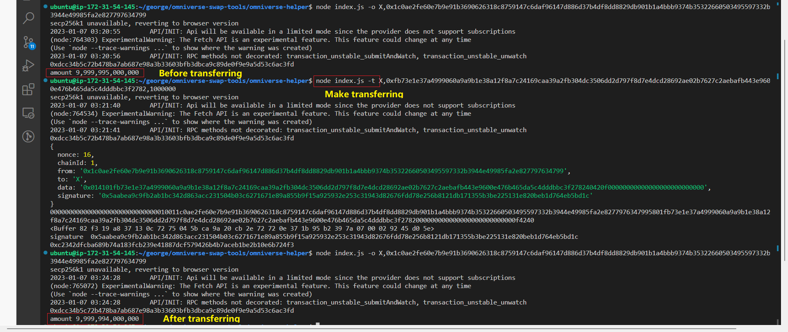
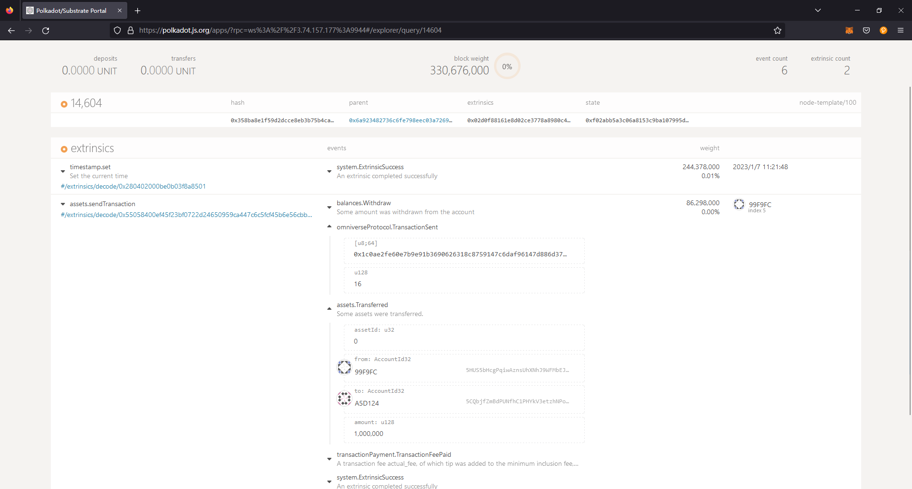

# Tutorial
*This document helps beginners taste the basic functions of `O20k` step by step.*  

## Index
* [Prepare Environment](#environment)
* [Install](#tools-install)
* [Omniverse Account](#omniverse-account)
* [Omniverse Token](#omniverse-token-protocol)
* [Omniverse Swap](#omniverse-swap-protocol)  

## Environment
* [Connection](#connection)
* [Deployment](#deployment)
    * [`O20k` Parachain](#parachain-of-o20k)
    * [EVM chains](#evm-chains)
* [Smart contracts on EVM Chains](#evm-chains)
* [Get Gas Token](#get-gas-tokens)

### Connection
The Parachain of `O20k` is deployed at `ws://3.74.157.177:9944`, and we recommand using [Polkadot.js](https://polkadot.js.org/apps/#/explorer) to connect to it.  

<p align='center'>Figure.1 Connect to `O20k` Parachain</p>  

If succeed, you can find the related pallets at [Extrinsics](https://polkadot.js.org/apps/#/extrinsics):  
  

### Deployment
To make it convenient, we have already deployed two kinds of Omniverse Tokens, token $X$ and token $Y$, which have been already registered onto the pallet of the Omniverse swap on the `O20k` Parachain of Polkadot.  

<!-- ***Note that the precision of the Omniverse tokens is $10^{0}$.*** -->

#### Parachain of `O20k`
* Pallet `OmniverseFactory` is mainly used to make transactions:  
    * The `tokenId` of Token $X$ is `X`
    * The `tokenId` of Token $Y$ is `Y`
* Pallet `OmniverseSwap` is mainly used to make exchanges.  

#### EVM chains
The Omniverse tokens are also deployed as smart contracts on some EVM chains.  
* Avalanche
    * Smart contract of Token $X$ address: `0x`
    * Smart contract of token $Y$ address: `0x`
* Moonbeam
    * Smart contract of Token $X$ address: `0x`
    * Smart contract of Token $Y$ address: `0x`

## Tools Install
The Omniverse operation tools can be found [here](to be done).  
* Go to the [repo of the tools](../src/to be done).
* If you do not clone the whole hackathon repo, you can just clone the repo [here](https://github.com/virgil2019/omniverse-swap-tools/tree/main). 
* Install the dependent packages.  
    ```sh
    npm install
    ```
* The explanation of the commands.
    ```sh
    node index.js --help
    ```

## Omniverse Account
Omniverse operations are all based on the Omniverse account, which is equivalent to the native address on each chain and is interconvertible. When making an operation on a concrete chain(e.g. `O20k` Parachain on Polkadot), we can use the original Polkadot account/address or the Omniverse account. It's transparent for users.  
Currently, we have made a specific tool to operate Omniverse Account.  
* [Create Account](#create-account)
* [Check the Account](#check-the-account)

### Create Account
As we mentioned before, the Omniverse account is equivalent to the native account. We can create an new account through the [Polkadot.js/apps](https://polkadot.js.org/apps/#/accounts)
  
<p align='center'>Figure.2 Create an Omniverse account through Polkadot.js/apps</p>  

***Note that***:  
1. Choose `Raw seed`
2. Choose `ECDSA (Non BTC/ETH compatible)` in `keypair crypto type`
3. Record the value of the `secret seed`, which will be used in the Omniverse account tool.

#### Get Gas Tokens
Before using the new account created by [Create Account](#create-account) in the `Omniverse Tools` below, you need to get some gas tokens first as shown in *Figure.3*.  
* Use the default account `Alice` of the Parachain to send some gas tokens to your new account directly.
  
<p align='center'>Figure.3 Get some Gas Tokens</p>  


### Check the Account
You can check the information of the account with the `secret seed` mentioned at [previous chapter](#create-account).  
* Create a new file named `.secret` at the same path of [.secret-example](), and set the `secret seed` in it, the content of which is something as below:  
    ```json
    {
        "sks": [
            "b4c88b446aa0923be87ca6e02e4c767bd6xxxxxxxxxxxxxxxxxxxxxxxxxx",
            "a4c88b446aa0923be87ca6e02e4c767bd6xxxxxxxxxxxxxxxxxxxxxxxxxx"
        ],
        "index": 0,
        "mpc": "0x0c8db4e26ae7a9e48a9d5cca8941698dd1338e037d89a47bf2853d8ef3c1723a3bad2a9916c5ee0ed0aa17396a6b4831352f51ee122b4951b51e20896356175b"
    }
    ```
    * `sks` are secret keys of the Omniverse Accounts. Normally, we need to create two keys that one is the sender and the other is the receiver, as we will do [Omniverse Transferring](#make-transaction-of-omniverse-token) later.
    * `index` means which account is used to make transactions, which starts from `0` and it is related to the first secret key in `sks`.
    * `mpc` is the abstract account of the Swap, and just copy it into your `.secret` file as above.  

* Check the information of your account with the command below:  
    ```sh
    # command to get the account information, including:
    # Omniverse Account
    # account on Polkadot
    # account on EVM chains
    # @ -a, --account
    node index.js -a
    ```
    * You may see something as follows:  
  

## Omniverse Token Protocol
The operations related to the Omniverse Token Protocol(`OTP`) include `Claim`, `balance of`, and `transfer`.  
* [Claim](#claim)
* [Check the balance](#check-the-balance)
* [Transaction](#make-transaction-of-omniverse-token)
    * [Initiate a transaction](#initiate-the-omiverse-transaction)
    <!-- * [Initiate on EVM chains](#initiate-transaction-on-evm-chains) -->

### Claim
* `Claim` Token $X$:  
    ```sh
    # to be done
    ```
* `Claim` Token $Y$:
    ```sh
    # to be done
    ```

### Check the balance
#### Check balance on Polkadot
* Check `balance of` Token $X$ of related account on Polkadot:  
    ```sh
    # -o, --omniBalance <tokenId>,<omniverse account>
    node index.js -o X,0x256077...
    ```
    * `X` is the tokenId mentioned [above](#parachain-of-o20k).  
    * `0x256077...` is the Omniverse Account got by [-a/--account](#check-the-account).  
    * **Note that** there is `,` between the paremeters.  

* Check `balance of` Token $Y$ of related account on Polkadot:  
    ```sh
    # -o, --omniBalance <tokenId>,<omniverse account>
    node index.js -o Y,0x256077...
    ```

#### Check balance on EVM chains
* Check `balance of` Token $X$ of related account on EVM chains:  
    ```sh
    # to be done
    # `token X` of related account
    ```
* Check `balance of` Token $Y$ of related account on EVM chains:  
    ```sh
    # to be done
    # `token Y` of related account
    ```

### Make transaction of Omniverse Token
#### Initiate the Omiverse transaction
* Transfer Token $X$ to another account on Polkadot:
    ```sh
    # --transfer <tokenId>,<pk>,<amount> 
    node index.js -t X,0x256077...,66
    ```
    * `X` is the example tokenId of token $X$.
    * `0x256077...` is the receive Omniverse Account. You can get the Omniverse Account by [get account](#check-the-account).
    * `66` is the amount of transferred token $X$.

* Check `balance of` Token $X$ of sender and receiver account as detailed at [Check the balance](#check-the-balance) above.  
    * Check `balance of` Token $X$ of related account on Polkadot:  
    ```sh
    # sender
    # -o, --omniBalance <tokenId>,<omniverse account>
    node index.js -o X,<o-account of sender>
    # receiver
    # -o, --omniBalance <tokenId>,<omniverse account>
    node index.js -o X,<o-account of receiver>
    ```
    * You may find outputs as follows:  
      
      

    * Check `balance of` Token $X$ of related account on EVM chains:  
    ```sh
    # to be done
    # `token X` of sender account
    # `token X` of receiver account
    ```
    * You can check the transaction on EVM chains [here](to be done), as follows:  
    

## Omniverse Swap Protocol
The key operation of the Omniverse Swap Protocol(OSP) is `Make exchanges`.  
* [Make exchanges](#make-exchanges)
* [Check the balance](#check-the-balance-after-exchanges)

### Make exchanges
* Swap Token X with Token Y:  
    ```sh
    # to be done
    ```
* Swap Token Y with Token X:  
    ```sh
    # to be done
    ```
### Check the Balance after exchanges
* Check `balance of` Token $X$ of related account on Polkadot:  
    ```sh
    # -o, --omniBalance <tokenId>,<omniverse account>
    node index.js -o X,0x256077...
    ```
* Check `balance of` Token $Y$ of related account on EVM chains:  
    ```sh
    # to be done
    # `token Y` of related account
    ```

We can found that the related states changed simultaneously both on Polkadot and EVM chains.  
 